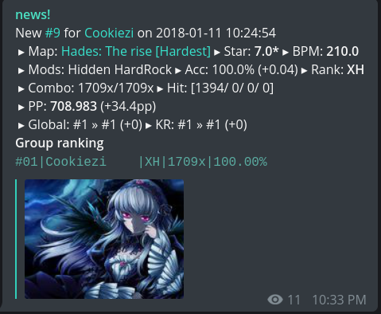

# track!

* 
* 
## Description
* A Telegram bot that tracks osu! players for theirs new top scores
* This is a part of *hime* project - an attempt to create a feature-rich and
good-integrated bot for my osu! group

## Features
* Tracks osu! players for each interval of time
* Using goroutine to fetch the scores simultaneously
* Using sqlite3 to store old stats
* Generates group ranking message

## Dependencies
* [telegram-bot-api](https://github.com/go-telegram-bot-api/telegram-bot-api)
* [go-osuapi](https://github.com/thehowl/go-osuapi)
* [go-sqlite3](https://github.com/mattn/go-sqlite3)

## Authors
* l4

## License
* MIT
